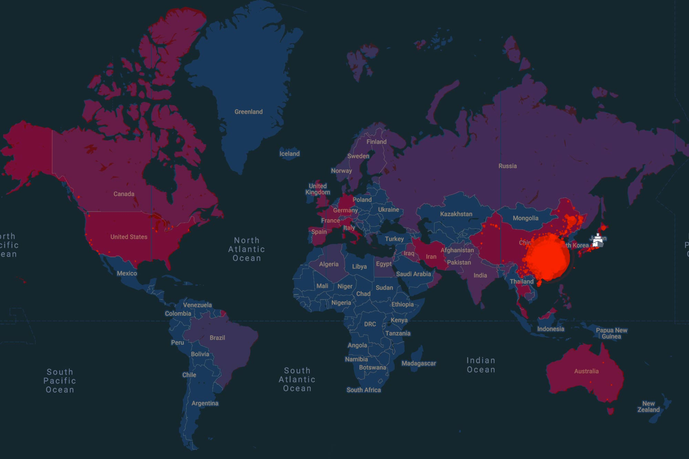

# Corona-Scraper
Corona-Scraper is a live monitoring tool useful for vigilants and medical staffs which is capable of tracking the COVID-19 global pandemic.
 
 

## Features
- #### Displays real-time information related to the COVID-19 country wise:
  - Country affected
  - Total number of cases
  - New cases
  - Total deaths
  - New deaths
  - Total recovered
  - Active cases
  - Serious/critical cases
  - Total cases per 1 million population
  - Total deaths per 1 million population
   
   

- #### Fetches data on startup:
  - The application fetches updated data from server on startup so that updated data is showed to the user every time the application is launched
   
   
  _NOTE:This feature will only work if the system is connected to internet at application launch_
   
   
- #### Displays the connection status(*):
  - Displays the connection status in the status bar whether the sytem is connected to the internet or not
   
   
- #### Displays the last update time(*):
  - The status bar displays the last time the data was fetched from the server so that users can keep track of the numbers
   
   
- #### Works in offline mode:
  - Able to store the data when online and retrieve it if the system is offline
   
   
- #### Supports two types of desktop modes:
  - _Application mode_  
    In the application mode, the user can minimize, restore or move the app across the desktop. The application mode comes with the title bar
   
   

  - _Widget mode_  
    In the widget mode, the app will stay at a place on desktop without any docking options and will remain afloat above all other applications. To move the app, user needs to switch to application mode. There is no title bar in the widget mode
   
   
  
- #### Supports two themes(*):
  - Light theme
  - Dark theme

__The features marked star are currently in development stage__
 

## User Interface: 

 

## How the project idea evolved:
_During the lockdown period, I was looking for some python projects, specifically in the web scraping domain. All the projects that I came through on the web were mostly related to scraping tweets from twitter or some random html from dummy websites or stuff more or less similar to the formers. Then the idea of scraping websites for data of COVID-19 effected countries crossed my mind. Although websites did great at serving the information to people on the web, a desktop application would go a step further by providing information at your desktop. Moreover, it would be helpful if it could work offline._

## Resources
- [Learn about the basics of status codes returned by websites]("https://kinsta.com/blog/http-status-codes/")
- [Quick reference to status codes]("https://www.restapitutorial.com/httpstatuscodes.html")
- [Web scraping tutorial]("https://realpython.com/beautiful-soup-web-scraper-python/")
- [Working with CSV files]("https://www.programiz.com/python-programming/csv")
- [Reading from CSV files in detail]("https://www.programiz.com/python-programming/reading-csv-files")
- [Writing to CSV files in detail]("https://www.programiz.com/python-programming/writing-csv-files")
- [Complete Tkinter tutorial for beginners]("https://www.youtube.com/watch?v=YXPyB4XeYLA")

## Technologies used:
  - python3
  - beautifulsoup4
  - tkinter library
  - requests library

## How to install requirements:
  - pip install tkinter
  - pip install beautifulsoup4
  - pip install requests
    
## Create your own executable
    '''
    pip install pyinstaller
    cd script_folder
    pyinstaller script.py                       //for executable with dependencies
    pyinstaller --onefile script.py             //standalone executable file with terminal
    pyinstaller --onefile -w script.py          //standalone executable without terminal
    '''
    
**The executable will be located in the script_folder/dist directory**
 
_To create a setup use NSIS open source software_
 
_To compress the exe significantly use strip.exe then UPX_

## Disclaimer
- All the data are fetched from third-party websites and I am in no way responsible for the correctness of it
- Websites constantly change. Once the site’s structure has changed, the scraper might not be able to navigate the sitemap correctly or find the relevant information.
- In such a scenario, please either contact me [skilite007@gmail.com] or submit a pull request suggesting the required changes 